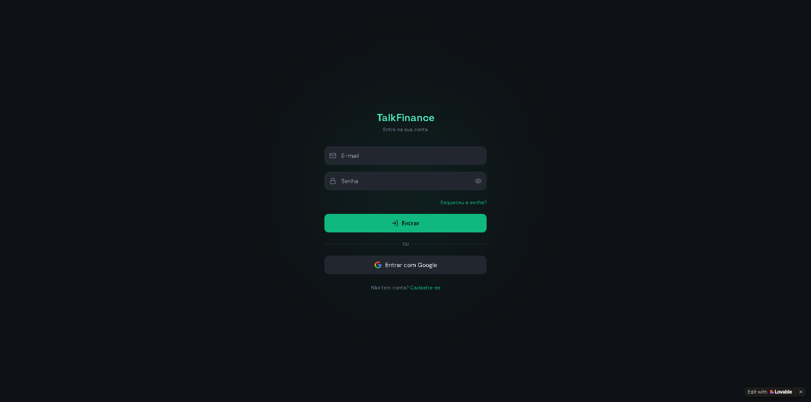
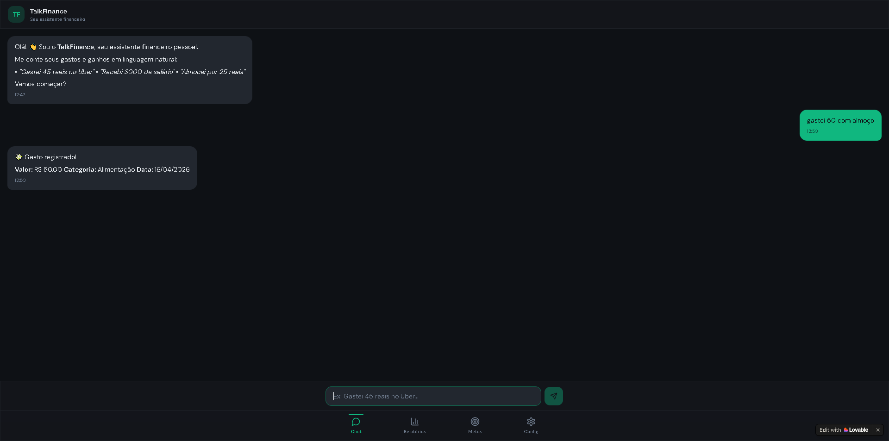
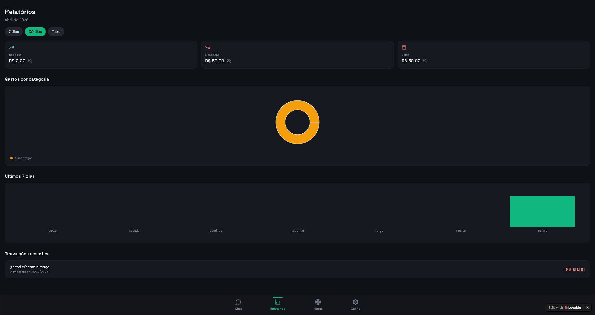
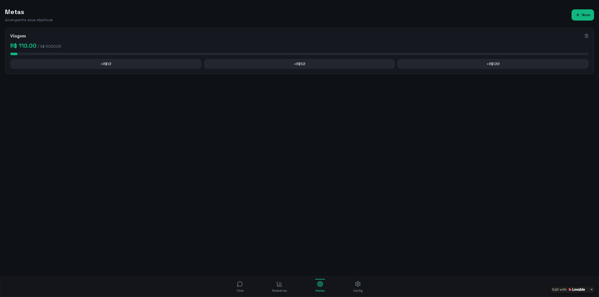
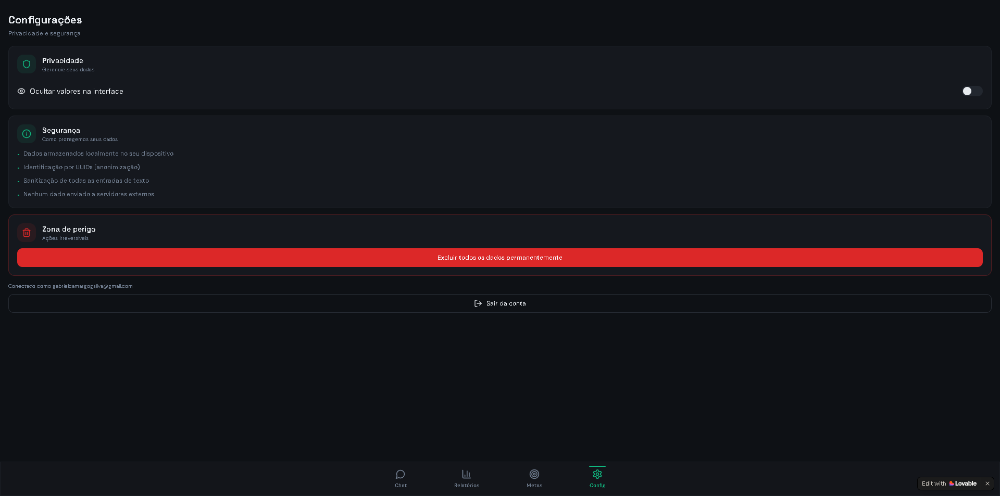

# App de Finanças Pessoais do Gabriel com Vibe Coding

Este projeto foi desenvolvido como um Desafio de Projeto da DIO de Vibe Coding utilizando o Lovable e o Gemini. A proposta era criar um aplicativo de finanças pessoais com base em interações em linguagem natural. 

---

PRD (Product Requirements Document) refinado no Gemini:

```markdown
# PRD: App de Financas Pessoais TalkFinance (MVP)

## 1. Visao Geral
* Objetivo: Facilitar o controle financeiro atraves de uma interface de chat (linguagem natural), removendo a friccao de preenchimento de planilhas.
* Diferencial: Foco total em privacidade, seguranca de dados sensiveis e simplicidade extrema para iniciantes.

---

## 2. Publico-Alvo
* Pessoas que tem dificuldade em manter o habito de anotar gastos.
* Usuarios que preferem interfaces conversacionais a formularios complexos.
* Iniciantes em educacao financeira.

---

## 3. Funcionalidades-Chave

### 3.1. Interface de Chat (Input Natural)
O usuario deve ser capaz de registrar transacoes via texto simples.
* Exemplo: "Gastei 45 reais no Uber agora."
* Seguranca: O sistema deve realizar a sanitizacao da entrada de texto para evitar ataques de Injection.

### 3.2. Classificacao Inteligente
O sistema deve extrair o valor, a categoria e a data automaticamente via processamento de linguagem natural (NLP).
* Regra de Negocio: Se a categoria nao for identificada, o app deve solicitar a confirmacao do usuario.

### 3.3. Agente Financeiro e Dicas
Envio de insights baseados nos gastos registrados.
* Privacidade: O processamento deve ser feito de forma segura, garantindo que dados de identidade nao sejam expostos a modelos publicos.

### 3.4. Dashboard de Metas
Visualizacao do progresso de economia mensal e graficos de gastos por categoria.

---

## 4. Requisitos de Seguranca

| Requisito | Descricao Tecnica | Implementacao Sugerida |
| :--- | :--- | :--- |
| Protecao de Acesso | Impedir acesso nao autorizado ao app. | Biometria (FaceID/Digital) ou PIN. |
| Criptografia de Dados | Proteger dados em repouso. | Criptografia AES-256 no banco de dados. |
| Mascaramento | Ocultar dados sensiveis na interface. | Botao para ocultar/exibir valores totais. |
| Anonimizacao | Desvincular dados financeiros de dados pessoais. | Uso de UUIDs para identificacao de registros. |

---

## 5. Plano de MVP (Fluxo de Telas)

1. Tela de Onboarding: Cadastro e configuracao de seguranca (biometria).
2. Tela de Chat: Interface principal para entrada de dados e historico.
3. Tela de Relatorios: Exibicao de gastos e metas de economia.
4. Configuracoes: Gestao de privacidade e opcao para exclusao definitiva de dados.

---

## 6. Instrucao para Geracao de Codigo (Prompt)

"Atue como um desenvolvedor Full Stack focado em seguranca. Com base neste PRD, crie a estrutura inicial de um banco de dados SQLite para um app de financas. Implemente uma funcao em Python que sanitize a entrada do usuario e prepare os campos de valor e descricao para armazenamento criptografado."


```
Interações com o Lovable:

>Crie um app de Finanças pessoais com base no seguinte PRD (Product Requirements Document): {prd}

>adicione login e cadastro, além de incluir login com Google através do OAuth, inclua tela de esqueci minha senha para obter uma redefinição de senha

Somente duas pois acabou os créditos.

Resultado final no lovable: https://insight-chat-finance.lovable.app/login

---

### Galeria do App
| Login e Cadastro | Interface de Chat | Relatórios |
| :---: | :---: | :---: |
|  |  |  |

| Metas Financeiras | Configurações |
| :---: | :---: |
|  |  |

---


## Resumo do que faz o app:

O app de finanças pessoais TalkFinance é uma aplicação móvel que permite aos usuários registrar e acompanhar suas despesas de forma simples. Através de uma interface de chat, os usuários podem inserir suas transações financeiras usando linguagem natural, como "Gastei 45 reais no Uber agora". O sistema utiliza processamento de linguagem natural (NLP) para extrair automaticamente o valor, a categoria e a data da transação.
O app também oferece uma tela de relatórios onde os usuários podem visualizar gráficos de gastos, sua receita mensal, despesas e seu saldo atual, além de visualizar o histórico de transações.
O app inclui uma tela de metas onde os usuários podem definir objetivos financeiros, como economizar para uma viagem ou pagar dívidas, e acompanhar seu progresso em direção a esses objetivos.

## Reflexão

### O que funcionou bem: 
- É possível registrar transações usando linguagem natural, e o sistema classifica automaticamente as transações em categorias.
- A tela de relatórios fornece uma visão clara dos gastos e do progresso financeiro do usuário.
- A tela de metas permite que os usuários definam e acompanhem seus objetivos financeiros.
- Funcionalidade de login e cadastro, incluindo login com Google através do OAuth, e a opção de redefinição de senha.

### O que não funcionou como esperado: 
- Esperava obter mais interações com o Lovable, mas os créditos grátis acabaram rapidamente, limitando a quantidade de funcionalidades que pude implementar e testar.
- A aba de metas não atualiza o saldo atual do usuário, o que pode causar confusão sobre o progresso em direção às metas.
- A aba de configurações tem a opção de ocultar valores, mas isso não está funcionando corretamente, e os valores ainda são visíveis mesmo quando a opção está ativada.


### O que aprendi sobre conversar com IAs: 
- A importância de fornecer instruções claras e específicas para obter os resultados desejados.
- A necessidade de revisar e ajustar as instruções com base nos resultados obtidos para melhorar a precisão e a funcionalidade do aplicativo.
- A capacidade de uma IA de gerar código funcional e criar interfaces de usuário com base em um PRD detalhado, mas também a necessidade de intervenção humana para garantir que todas as funcionalidades estejam implementadas corretamente e funcionando como esperado.


